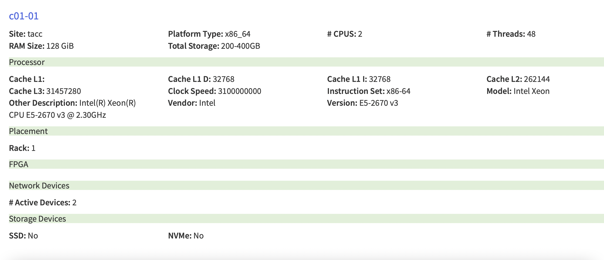
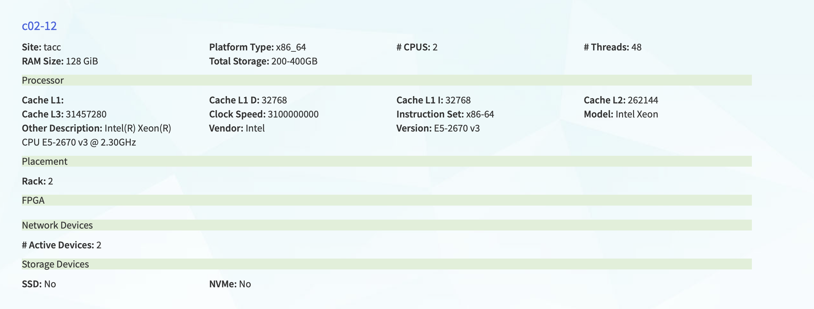
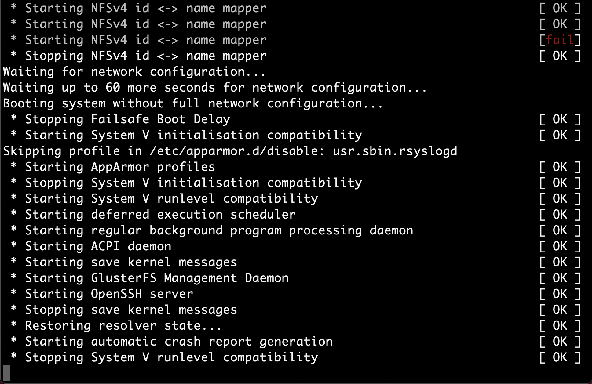
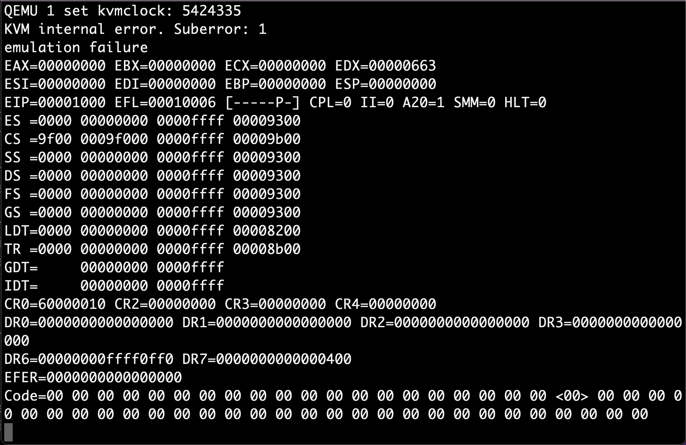

# LegoOSGiantVMReport
Install the following files from online for this configuration process
CentOS-7-x86_64-GenericCloud-20150628_01.qcow2
ubuntu-14.04-server-amd64.qcow2
ubuntu-14.04.3-server-amd64.iso

This README contains a full description about how I went about configuring LegoOS and GiantVM. Along the way I will display the error that occured and how I solved or went around them. Please feel free to reachout to me if anyone reading this has any questions!

Before following this guide, please install all the necessary packages (all these packages are assuming you are using Centos7.2)

## Configuring LegoOS
Click [Here](https://github.com/WukLab/LegoOS) to view LegoOS repository

When confiugring LegoOS, I had to bear in mind the system requirements the originial creators used to build LegoOS. It is reccomended to try to minic the original build specs to minimize the amount of errors during the build process. Most of the software and hardware specifications are soft requirements, but there are two hard requirements. Using a CPU similar to a Intel Xeon E5-2620 v3, a Mellanox MCX354A-TCBT ConnectX-3 VPI network interface card, and Melanox IS5035 Infiniband switch. Whatever system you are building must have at least two servers connectd to a command switch via infinibands. For the build, I used the compute_haswell_ib nodes available at the TACC Chameleon site. 


Figure 1: Specs I used for my instances

I created two instances of with the same specs as Figure 1. I chose to use Centos7.2 because that was what the original creators used to configure LegoOS. 

After the instances were ready, I sshed into them and checked whether or not I was able to invoke the infinibands ontop of the instances (this is just a safety check because they are necessary for LegoOS). To do this I ran 

```
[cc@stepping-through-akhil-1 ~]$ ibstat
CA 'mlx4_0'
	CA type: MT4099
	Number of ports: 1
	Firmware version: 2.42.5000
	Hardware version: 1
	Node GUID: 0xe41d2d0300011c60
	System image GUID: 0xe41d2d0300011c63
	Port 1:
		State: Active
		Physical state: LinkUp
		Rate: 56
		Base lid: 13
		LMC: 0
		SM lid: 5
		Capability mask: 0x02594868
		Port GUID: 0xe41d2d0300011c61
		Link layer: InfiniBand
```

At this point it is important that you have read through the LegoOS repository to familiarize yourself with the technology being confiugred. For my project, I concentrated on the 1P-1M configuration. This configuration requires two indiviudal machines. These machines can be VMs (on seperate hosts) or physical or a combination of both. I used two seperate virtual machines on two seperate physical hosts. I chose to do this because I kept recieving the following error when trying to install the LegoOS kernel modules. These kernel modules can only be compiled with a linux kernel of 3.11.1
```
[cc@stepping-through-akhil-1 linux-stable]$ sudo make install
sh /home/cc/linux-stable/arch/x86/boot/install.sh 3.11.1 arch/x86/boot/bzImage \
	System.map "/boot"
grubby fatal error: unable to find a suitable template
```

I spent a considerate amount of time trying to solve this error. With Chameleon instances, the reboot time taken around 5-10 mins. Because of this, I decided to switch from configuring LegoOS on two physical hosts to two Virutal-Machines on two seperate hosts. It should be noted that LegoOS does approve of this method. 

### Setting up the Virtual Machines
In order to create LegoOS with two virutal machines with Chameleon instances, you must create your own private network. This is because the default `sharednet` network provided in the chameleon doesn't allow static or dhpc IP allocation to new entities going into the network. Because of this issue, you must create your own private network. Since I used qemu to
#### Creating Private Network
In order to create your own private network please follow the following link to create it.
Link: https://chameleoncloud.readthedocs.io/en/latest/technical/networks/networks_vlan.html 
1. If working on Chameleon with your own private network you may need to make a network to bring up your personal network. Example scipt would like this:
```
BOOTPROTO=dhcp
DEVICE=eth1
BRIDGE=br10
HWADDR=44:a8:42:26:e9:8e
ONBOOT=yes
TYPE=Ethernet
USERCTL=no
```
2. Create network scipt for the network bridge `touch etc/sysconfig/network-scripts/ifcfg-br10`
add the following to the scipt
```
DEVICE=br10
STP=no
TYPE=Bridge
BOOTPROTO=static
DEFROUTE=yes
NAME=br10
ONBOOT=yes
DNS1=8.8.8.8
DNS2=129.114.97.1
DNS3=129.114.97.2
IPADDR=192.168.1.97
PREFIX=24
GATEWAY=192.168.1.1
```
3. Append the following line to the network script you want to pass to the VM `BRIDGE=br10`

#### Enalbing PCI passthrough of infiniband 
1. Add `intel_iommu=on intel_iommu=pt` to the `GRUB_CMDLINE_LINUX` line in the file `/etc/sysconfig/grub` to 
Enable pci passthrough
2. Update grub configuration 
```
sudo grub2-mkconfig -o /etc/grub2.cfg
sudo grub2-mkconfig -o /etc/grub2-efi.cfg
```
3. If confused on finding pci device of your infiniband run the following `lspci | grep <infiniband_nic_name>`, for example, `lspci | grep Mellanox`

#### Using Virt-Manager to create VMs with bridged network with infiniband passthorughed enabled
These are the steps that I went through to create the virtual machine network for LegoOS on Chameleon 
1. Downloaded image to use for VM
2. Resize image `sudo qemu-img resize <image_name> 80G`
3. Make images directory if not created already `sudo mkdir -p /var/lib/libvirt/images`
4. Create a cloud config file for your VM
```
#cloud-config
password: 123456
chpasswd: { expire: False }
ssh_pwauth: True
hostname: VM-Name
```
5. Generate configuration ISO for your VM `sudo cloud-localds /var/lib/libvirt/images/VM-Name.iso VM-Name.txt`
6. Deploy cloud image as a VM:   
```
sudo virt-install --name VM-Name --ram 32768 --vcpus 8 --disk /var/lib/libvirt/images/VM-Name.qcow2,device=disk,bus=virtio --disk /var/lib/libvirt/images/VM-Name.iso,device=cdrom --os-type linux --virt-type kvm --graphics none --network bridge=br10 --host-device=pci_0000_03_00_0 --import
```

#### Installing and Configuring LegoOS 
Both of these steps should be done  
1. `git clone https://github.com/WukLab/LegoOS.git`
2. `make defconfig` follow stpes on LegoOS repo for information on what options to do
3. `cp Documentation/configs/1P-1M-Processor .config`
4. On VM for Processor monitor run make in `$LegoOSDirectory`
4. On VM for Memory monitor run make in `$LegoOSDirectory/usr/` then run make in `$LegoOSDirectory`
Error: This error occurs on the memory monitor if the test usr programs were not compiled.
```
managers/memory/ramfs/piggy.S: Assembler messages:
managers/memory/ramfs/piggy.S:15: Error: file not found: usr/general.o
make[3]: *** [managers/memory/ramfs/piggy.o] Error 1
make[2]: *** [managers/memory/ramfs] Error 2
make[1]: *** [managers/memory] Error 2
make: *** [managers] Error 2
```
Solution: Please go to `$LegoOSDirectory/usr/` and run `make`

Error: This error occurs on the memory monitor if you run `make` when trying to compile test usr programs for the memory monitor
```
gcc -g -o seq.o -static -I..//arch/x86/include -I..//arch/x86/include/generated -I..//arch/x86/include/generated/uapi -I..//include seq.c -lm -pthread
/bin/ld: cannot find -lm
/bin/ld: cannot find -lpthread
/bin/ld: cannot find -lc
collect2: error: ld returned 1 exit status
make: *** [seq.o] Error 1
```
Solution: This package allows for packages to be statically linked which is requried for LegoOS because the `Makefile` uses the `-static` flag
```
sudo yum -y install glibc-static
```
5. Edit `$LegoOSDirectory/net/lego/fit_machine.c` and `$LegoOSDirectory/linux-modules/fit/fit_machine.c` and add lid information. Run `iblinkinfo` to find the lid information for your infinibands. Also, add the hostnames for each VM. Plese refer to the LegoOS repository for more information. 
6. Clone linux-stable git repository and install linux kernel v3.11.1. This is mandatory to compile LegoOS kernel modules
```
git clone git://git.kernel.org/pub/scm/linux/kernel/git/stable/linux-stable.git
cd linux-stable
cp -v /boot/config-$(uname -r) .config
git checkout v3.11.1
sudo yum install -y "Development Tools" ncurses-devel bison flex elfutils-libelf-devel openssl-devel
sudo make menuconfig
sudo make -j $(nproc)
sudo make modules_install 
sudo make install 
```
reboot and choose kernel 3.11.1
7. Go to $LegoOSDirectory/linux-modules and run `make` 

Error: This error occurs if the kernel version is not 3.11.1
```
make -C /home/centos/LegoOS/linux-modules/fit
make[1]: Entering directory `/home/centos/LegoOS/linux-modules/fit'
make -C /lib/modules/3.10.0-1160.36.2.el7.x86_64/build M=/home/centos/LegoOS/linux-modules/fit modules
make: Entering an unknown directory
make: *** /lib/modules/3.10.0-1160.36.2.el7.x86_64/build: No such file or directory.  Stop.
make: Leaving an unknown directory
make[1]: *** [all] Error 2
make[1]: Leaving directory `/home/centos/LegoOS/linux-modules/fit'
make: *** [/home/centos/LegoOS/linux-modules/fit] Error 2
```
Solution: Refer to step 6

8. Install LegoOS Kernel `make install` in `$LegoOSDirectory`

Error:
```
depmod: ERROR: could not open directory /lib/modules/4.0.0-lego+: No such file or directory
depmod: FATAL: could not search modules: No such file or directory
Kernel version 4.0.0-lego+ has no module directory /lib/modules/4.0.0-lego+
```
Solution: It is not known. From current understanding, this is caused by an error when installing the LegoOS kernel modules. This is because, in a typical linux kernel installation, when the kernel modules are installed a directory for the installed kernel is made in `/lib/modules/`. After step 7 this does not occur. 


## Configuring GiantVM
Specs of instances used



For this configuration, I used two compute haswell instance from Chameleon and used Ubuntu16.04 for my operating system
Refer to the GiantVM directory for general information on installing GiantVM.

1. Clone QEMU directory `git clone https://github.com/GiantVM/QEMU.git`
2. Change the shared file pathname and default port. Edit $QEMU_DIR/interrupt-router.c ROUTER_SOCKET_PREFIX and ROUTER_TCP_DEFAULT_PORT
To create unix socket run the following command on each machine.
```
python -c "import socket as s; sock = s.socket(s.AF_UNIX); sock.bind('/tmp/test.sock')"
```
3. Create 2.6 python environment because it is needed for the rest of the configuration process 
```
virtualenv -p /usr/bin/python2 venv
source venv/bin/activate
```
4. Compile distributed qemu 
```
$QEMU_DIR/configure --target-list=x86_64-softmmu --enable-kvm
make
```
5. The following commands are listed to do next on the QEMU repostitory. However, they all lead to an indefinite hanging state. Below is an example what it states.


Solution: Download and .iso and .qcow2 image instead of running steps II listed on GiantVM repistory. 
These files can be found in this repository. The names are ubuntu-14.04-server-amd64.qcow2 and ubuntu-14.04.3-server-amd64.iso

6. Clone the Linux-DSM repostory `git clone https://github.com/GiantVM/Linux-DSM.git`
7. Compile it like a typical linux kernel refer to step 6 of Confiugring LegoOS
Error: Is errors occur where variables are not defined please refer to the `.config-linuxdsm` for a correct configuration 
8. Install OVMF bios to provide extra boot informatioon for step 9
```
sudo apt install -y OVMF
```
9. Run the following commands in order to boot into the GiantVM virtual machines 
```
On VM1
x86_64-softmmu/qemu-system-x86_64 --nographic -hda ../ubuntu-14.04-server-amd64.qcow2 -kernel ../linux-stable/arch/x86/boot/bzImage -append "root=/dev/sda1 console=ttyS0"  -machine kernel-irqchip=off -smp 2 -m 5G -serial mon:stdio -local-cpu 1,start=0,iplist="VM1_ip VM2_ip" -net nic,model=virtio -monitor telnet:127.0.0.1:1234,server,nowait  -cdrom ../ubuntu-14.04.3-server-amd64.iso -boot d --enable-kvm -shm-path cc -bios /usr/share/ovmf/OVMF.fd

On VM2
x86_64-softmmu/qemu-system-x86_64 --nographic -hda ../ubuntu-14.04-server-amd64.qcow2 -kernel ../linux-stable/arch/x86/boot/bzImage -append "root=/dev/sda1 console=ttyS0"  -machine kernel-irqchip=off -smp 2 -m 5G -serial mon:stdio -local-cpu 1,start=1,iplist="VM1_ip VM2_ip" -net nic,model=virtio -monitor telnet:127.0.0.1:1234,server,nowait  -cdrom ../ubuntu-14.04.3-server-amd64.iso -boot d --enable-kvm -shm-path cc -bios /usr/share/ovmf/OVMF.fd

```

Error: Below is the output from running the installation commands

VM1: This output occurs on the VM listed first in the iplist flag of the installation command



VM2: This output occurs on the VM listed second in the iplist flag of the installation command



Currently, I am not 100% sure why this output occurs. I believe this error is caused by errors when the virtual machines try to communicate with eachother in the boot process. I tried the following:
10. Removing the -smp flag so the communication of the VMs is through the network and not shared memory

Next thing to try, is checking if $QEMU_DIR/interrupt-router.c is correctly written. Or, playing around with the commands in step 9. 